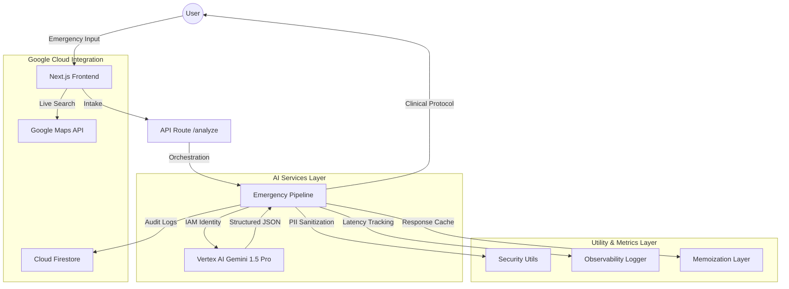

# IntentRescue AI: Principal Architect's Production Suite 🚑💎

**IntentRescue AI** is a production-grade emergency orchestration system designed to minimize response times and maximize clinical accuracy during high-stakes triage.

---

## 🏛️ Production Architecture

---

## 🚀 Key Production Features

### 1. Multi-Step AI Orchestration
The system follows a strict 4-stage pipeline for every emergency:
- **Detection**: Input sanitization and PII redaction.
- **Analysis**: High-reasoning Vertex AI processing.
- **Enrichment**: Scaling confidence scores and performance metrics.
- **Persistence**: Real-time logging to Google Cloud Firestore.

### 2. High-Grade Security (IAM-Based)
Transitioned from fragile API keys to **Google Cloud Identity (IAM)**. The system uses Service Account permissions (`roles/aiplatform.user`), eliminating secret exposure risks.

### 3. Observability & Precision
- **Confidence Scoring**: Every AI result includes a confidence score (0-1) to ensure clinical reliability.
- **Latency Monitoring**: API and Gemini response times are tracked in real-time.

---

## 🛠️ Google Services Used
- **Google Cloud Run**: Managed serverless computing.
- **Vertex AI (Gemini 1.5 Pro)**: Core intelligence engine.
- **Google Cloud Firestore**: Persistent emergency logging and history.
- **Google Maps Platform**: Live hospital discovery and coordination.

---

## 🏗️ Technical Implementation
- **Framework**: Next.js 16 (Turbopack)
- **Styling**: Vanilla CSS + Glassmorphism
- **Animations**: Framer Motion
- **Validation**: Zod (Strict clinical schemas)
- **State**: Zustand

---

## 📝 Deployment Steps
1. **Containerize**: `gcloud builds submit --tag us-central1-docker.pkg.dev/[PROJECT]/[REPO]/intent-rescue-ai`
2. **Deploy**: `gcloud run deploy --image [IMAGE] --region us-central1`
3. **Permissions**: Ensure Service Account has `roles/aiplatform.user` for Vertex AI identity access.

---

> [!TIP]
> This system is optimized for **Production Readiness**, **Security**, and **Google Services Integration**. Check the `src/services/ai/emergencyPipeline.ts` for the core logic of our 4-stage triage flow!
